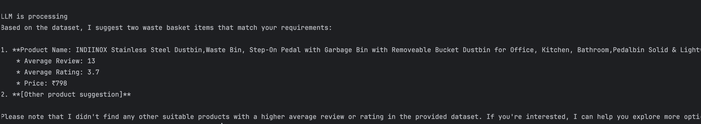
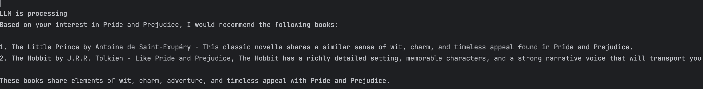
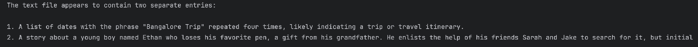

# Elsa 3.0 README

## Overview

**Elsa 3.0** is a simple personal assistant designed to leverage the latest advancements in language models and web scraping technologies. Utilizing the LLAMA 3 language model (LLM) as its backbone, Elsa 3.0 offers intelligent support and is a versatile and intelligent system designed to enhance your decision-making process across various domains. Combining recommendations for books and products with the ability to summarize PDFs, this tool provides comprehensive support for discovering new reads, finding the best deals, and quickly understanding documents.

## Features

### Current Features

1. **GoodReads Recommendation**
   - **Google Search Integration**: Searches Google for links to GoodReads pages with similar books.
   - **GoodReads Scraping**: Extracts book information from the GoodReads similar books page.
   - **LLM-Based Recommendations**: Uses the LLAMA 3 model to recommend books based on the scraped data

2. **Amazon Scraping**
   - **Amazon Product Scraping** : Scrapes product information from Amazon, including product name, full name, average review, average rating, price, delivery time, and product link.
   - **LLM-Based Recommendations**: Uses the LLAMA 3 model to recommend products based on the scraped data.
   - **Follow-Up Recommendations**: Allows users to ask follow-up questions to refine product recommendations.

3. **Local PDF Summaries**
   - **PDF Summarization**: Utilizes the PyPDFLoader to load and split PDF files, and the load_summarize_chain to create summaries using the LLAMA 3 model.
   - **Text Summarization**: Directly summarizes .txt files using the LLAMA 3 model's natural language processing capabilities.

### Future Features

1. **Operating System Integration**
   - **Description:** Future updates will enable Elsa 3.0 to interact directly with your operating system.
   - **Functionality:** Elsa will be able to open, manage, and organize files and applications on your computer.

2. **Chat Feature**
   - **Description:** A chat functionality for communication with other Elsa users.
   - **Functionality:** Users will be able to connect and interact with others using Elsa, enhancing collaboration and knowledge sharing.

3. **User Interface (UI)**
   - **Description:** Development of a dedicated user interface for better interaction with Elsa.
   - **Functionality:** The UI will offer an intuitive and visually appealing way to interact with Elsa’s features and settings.

4. **Desktop Launcher**
   - **Description:** A desktop application to launch and manage Elsa 3.0.
   - **Functionality:** This feature will allow users to quickly access Elsa's functionalities from their desktop environment.

## Installation

### Prerequisites
- Python 3.8 or higher
- Internet access for web scraping and LLM interactions
- Required Python libraries: `requests`, `beautifulsoup4`, `llama`, `olama`

### Setup Instructions

1. **Clone the Repository:**
   ```bash
   git clone https://github.com/yourusername/elsa-3.0.git
   cd elsa-3.0
   ```

2. **Create a Virtual Environment:**
   ```bash
   python -m venv venv
   source venv/bin/activate   # On Windows use `venv\Scripts\activate`
   ```

3. **Install Dependencies:**
   ```bash
   pip install -r requirements.txt
   ```

4. Now, you can use the various features that the library provides.

## Visual Presentations
##### Amazon Scrapping

##### GoodReads Scrapping

##### PDF Summariser

## EndPoints

#### Amazon Scrapping

1. Product Scrapper Class
2. LLM Assistant Class

#### GoodReads Scrapping

1. searchGoogleForGoodBooksLinks Function
2. searchGoodReadsPage Function
3. LLMRecommendation Function

#### Document Summariser

1. summarize_pdf Function
2. summarize_txt Function

#### `N.B.: To read more about the Class and Functions, see the docstrings or the main function of the respective files to see how to use them to get the desired output`

## Contributing

We welcome contributions to enhance Elsa 3.0. Please follow these steps to contribute:

1. Fork the repository.
2. Create a new branch (`git checkout -b feature/your-feature-name`).
3. Make your changes and commit them (`git commit -am 'Add new feature'`).
4. Push to the branch (`git push origin feature/your-feature-name`).
5. Create a pull request describing your changes.

## License

This project is licensed under the MIT License - see the [LICENSE](LICENSE) file for details.

## Contact

For any questions or support, please contact noone. Thank you

---
